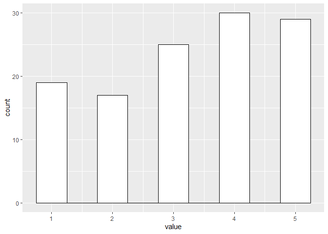

<!---The following chunk allows errors when knitting--->


**When you make an Rmd file for participation or homework, be sure to do this**:

1. Change the file output to both html and md _documents_ (not notebook).
  - See the `keep_md: TRUE` argument above.

2. `knit` the document. 

3. Stage and commit the Rmd and knitted documents.


# Intro to simulations in R

Load the `tidyverse` package.
    - This will mainly be used for GGplot, but some of the data manipulation tools may be useful.

Hint: You can add the `suppressPackageStartupMessages()` function around the 
      `library()` command to keep your output looking nice!
    

```r
# load your packages here:
suppressPackageStartupMessages(library(tidyverse))
```
    

## `rnorm()`

1. Simulate two datasets that follow a normal distribution. The first one should have a mean of 4 and SD of 1. The second one should have a mean of 8 and SD of 1.5. Both should have 200 cases.


```r
dataNormal1 <- data.frame("Values" = rnorm(200, mean = 4),
                         #Creates a grouping factor for our data
                         "Group" = "Group1")

dataNormal2 <- data.frame("Values" = rnorm(200, mean = 8, sd = 1.5),
                         #Creates a grouping factor for our data
                         "Group" = "Group2")
```

2. Combine the two datasets.


```r
dataNormalCombined <- rbind(dataNormal1,dataNormal2)
```

3. Graph these distributions using GGplot.


```r
ggplot(dataNormalCombined,aes(x=Values)) +
  geom_histogram(alpha=0.6, position = 'identity')
```

```
## `stat_bin()` using `bins = 30`. Pick better value with `binwidth`.
```

<!-- -->

4. Run summary stats of your three data sets


```r
summary(dataNormal1)
```

```
##      Values         Group    
##  Min.   :1.591   Group1:200  
##  1st Qu.:3.450               
##  Median :3.897               
##  Mean   :4.032               
##  3rd Qu.:4.674               
##  Max.   :6.904
```

```r
summary(dataNormal2)
```

```
##      Values          Group    
##  Min.   : 3.589   Group2:200  
##  1st Qu.: 6.663               
##  Median : 7.896               
##  Mean   : 7.858               
##  3rd Qu.: 9.060               
##  Max.   :11.793
```

```r
summary(dataNormalCombined)
```

```
##      Values          Group    
##  Min.   : 1.591   Group1:200  
##  1st Qu.: 3.883   Group2:200  
##  Median : 5.506               
##  Mean   : 5.945               
##  3rd Qu.: 7.892               
##  Max.   :11.793
```

5. Run a t-test on your data


```r
t.test(dataNormalCombined$Values~dataNormalCombined$Group)
```

```
## 
## 	Welch Two Sample t-test
## 
## data:  dataNormalCombined$Values by dataNormalCombined$Group
## t = -28.539, df = 327.92, p-value < 2.2e-16
## alternative hypothesis: true difference in means is not equal to 0
## 95 percent confidence interval:
##  -4.089248 -3.561847
## sample estimates:
## mean in group Group1 mean in group Group2 
##             4.031957             7.857505
```
### Back to guide

## `sample()`

1. Sample from 5 numbers that follow an inverted normal distribution. (i.e. the probabilities are highest at the end points and lowest in the center).


```r
#this is not a true inverted normal distribution. but it's symmetrical and does the general thing?
sample(c(1,2,3,4,5), 200, replace=T, prob = c(30,15,10,15,30)) %>% 
  hist()
```

<!-- -->

2. Pick one of the distributions that are [built into R](https://www.stat.umn.edu/geyer/old/5101/rlook.html) and replicate that distribution with the sample function. Make sure you graph both the original distribution and the reproduced distribution so you can make sure they match.


```r
#Add code for your initial distribution here. Make sure to use rDistributionFunction (ie, rbinom, rnorm, rchisq, etc) so that random numbers are generated.
set.seed(1337)

binomDist <- rbinom(n=10000,size=396,prob=.5)
hist(binomDist)
```

<!-- -->

```r
#Replicate your distribution with the sample function.
binomDistSamp <- sample(c(seq(0,396)), #scale points
       10000, replace=T, prob = c(dbinom(seq(0,396),size = 396,prob = .5)))
hist(binomDistSamp)
```

<!-- -->

### Back to guide

## ``for()`

1. Create a loop that generates a number from your favorite distribution and writes it to a column of your matrix. The matrix should have 20 rows and 1 column. You can use one of the distribution functions built into R, or create your own using `sample()`.

```r
set.seed(1337)
#Creates our matrix
binomWPExamp <-matrix(nrow=20,ncol=1)
#for loop to iterate over rows.  Does not need to have a second nested loop because there's only one column
for(j in 1:20){
  binomWPExamp[j,1] <- rbinom(n=1,size=396,prob=.5)
  }

dataBinomWPExamp <- as.data.frame(binomWPExamp)

hist(binomWPExamp)
```

<!-- -->

2. Write a loop within a loop. First, create a matrix with 20 rows and 6 columns. Save a number from your favorite distribution into each cell of the matrix. You can use one of the distribution functions built into R, or create your own using `sample()`. The distribution of responses should be the same for every person.


```r
set.seed(1337)
#Creates our matrix
binomWPExamp2 <-matrix(nrow=20,ncol=6)
#for loop to iterate over individuals
for(i in 1:20){
  #for loop to iterate over items within individuals
  for(j in 1:6){
      binomWPExamp2[i,j] <- rbinom(n=1,size=396,prob=.5) 
    }
}
dataBinomWPExamp2 <- as.data.frame(binomWPExamp2)
dataBinomWPExamp2Long <- gather(dataBinomWPExamp2, key = "key", value = "value", V1:V6, factor_key = FALSE)

#switched to ggplot instead of hist
ggplot(dataBinomWPExamp2Long, aes(value)) +
  geom_histogram(binwidth=0.5,color="black", fill="white")
```

<!-- -->

3. Repeat 2, but this time make your distribution centered within each person. - I'm not sure how to change this for distributions that already exist in R, so I'm just using the normal distribution example from the guide


```r
set.seed(1337)
#Creates our matrix
normalWPSample <-matrix(nrow=20,ncol=6)
#for loop to iterate over individuals
for(i in 1:20){
  #for loop to iterate over items within individuals
  for(j in 1:6){
    #first response randomly generated and set as the center point for all remaining responses
    if(j==1){ #remember j is our row, so this will sample a new center point whenever we are  on item 1 for a person.
      wInMean<-sample(1:5,1) #sets our mean. Could save in our matrix if we want to know it
          #We will sample a value that is the center point, or deviates from it by 1 or 2
      normalWPSample[i,j] <- sample(c(wInMean - 2, wInMean - 1, wInMean, 
                                      wInMean + 1, wInMean + 2), 
                                    #probabilities to sample these values
                                    1, replace=T, prob = c(6, 24, 40, 24, 6)) 
    }
    #all responses past first response. This function is the same as above, 
    #but we don't need to sample a value for the center point because we already have it
    else{
      normalWPSample[i,j] <- sample(c(wInMean - 2, wInMean - 1, wInMean, 
                                      wInMean + 1, wInMean + 2), 
                                    1, replace=T, prob = c(6, 24, 40, 24, 6)) 
    }
  }
}
dataNormalWPSample <- as.data.frame(normalWPSample)
dataNormalWPSampleLong <- gather(dataNormalWPSample, key = "key", value = "value", V1:V6, factor_key = FALSE)

#switched to ggplot instead of hist
ggplot(dataNormalWPSampleLong, aes(value)) +
  geom_histogram(binwidth=0.5,color="black", fill="white")
```

<!-- -->

3. If needed, replace any out-of-bounds data.

```r
#If there is a number greater than 5 replace it with 5
dataNormalWPSampleLong[dataNormalWPSampleLong>5]<-5
#If there is a number less than 1 replace it with 1
dataNormalWPSampleLong[dataNormalWPSampleLong<1]<-1

ggplot(dataNormalWPSampleLong, aes(value)) +
  geom_histogram(binwidth=0.5,color="black", fill="white")
```

<!-- -->

###Return to guide

## Conduct your own simulation study

You've now seen a few different methods we can use to simulate data. At this point you should be familiar with the `sample()`, `for()`, and `if()` functions and the distribution functions built into R. Now is your chance to use them to run your own simulation study.

1. Come up with an idea that can be simulated. 
- If you have a study idea you want to do a power analysis for this could be a good opportunity to try doing that
- You could simulate a study similar to our education intervention example. For instance, the implicit bias has been purported to influence police officer shooting decisions. One question might be, how big of a correlation would implicit bias need to have with police officer shooting decisions to account for 25% of the variance in those behaviors?
- There are also many papers that specify conceptual models of different psychological processes. You could try to replicate this conceptual model using simulated data.
2. Simulate your data. This simulation should use some of the more complex functions we covered, like a for loop, if statement, or some other type of logic. Just simulating one or two distributions using `rnorm()` is not enough for this part.
3. Write a summary of what you simulated and what you found.
NOTE: the resources section at the top of the main lab may be helpful if you're having trouble figuring out the right code to simulate what you want. This contains walkthroughs for different functions and simulation methods not covered here.

```r
# Current events have zapped pretty much all of my creativity and curiosity, so I can follow set directions but not generate new things.  Which does not bode well for my intended career as an academic, but hey, we are all learning new things about ourselves, right?
```
